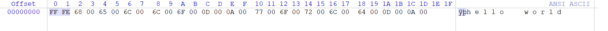

# echow
echow 是一个生成 echo 命令来写入二进制文件的小工具。

[简体中文](Readme.zh-CN.md) | [English](Readme.md)


# 使用方法

echow 的使用方法非常简单。

### 基本使用

```
NAME:
   echow - Generate echo commands to write binary file

USAGE:
   echow [global options] [arguments...]

GLOBAL OPTIONS:
   --file file, -f file      file path
   --number value, -n value  split the file into the specified number of parts (default: 1)
   --format hex/oct          choose octal or hex format: hex/oct (default: "hex")
   --name value              specify the file name (default: -f parameter value)
   --help, -h                show help (default: false)
```

### 运行示例

> 简单的例子

```
PS C:\> .\echow.exe -f .\Test.bin -n 3
echo -n -e "\x68\x65\x6c" >> Test.bin
echo -n -e "\x6c\x6f\x20" >> Test.bin
echo -n -e "\x77\x6f\x72\x6c\x64" >> Test.bin
```

> 将结果输出到文件

在 CMD 中使用 `>` 重定向符号即可：

```
.\echow.exe -f .\Test.bin -n 2 > test.txt
```

如果是在 PowerShell 中，建议使用如下命令：

```powershell
.\echow.exe -f .\Test.bin -n 2 | Out-File -Encoding ASCII test.txt
```


# 小贴士

> 出现问题：文件头存在额外数据 `0xFFFE`



这是因为，当你在 PowerShell 中使用 `>` 重定向符写入文件时，它会将文件视为 Unicode 编码。 因此，在文件头部会自动添加 `0xFFFE`，这是一个 [Unicode 字节顺序标记](https://learn.microsoft.com/zh-cn/windows/win32/intl/using-byte-order-marks?redirectedfrom=MSDN)（Byte Order Mark，BOM），用于表示文件中使用的 Unicode 编码方案。

> 解决方法

在 PowerShell 中使用 [Out-File](https://learn.microsoft.com/zh-cn/powershell/module/microsoft.powershell.utility/out-file) 重定向命令代替 `>` 符号，并使用 `-Encoding ASCII` 来指定编码为 ASCII 就不会出现这个问题了。

